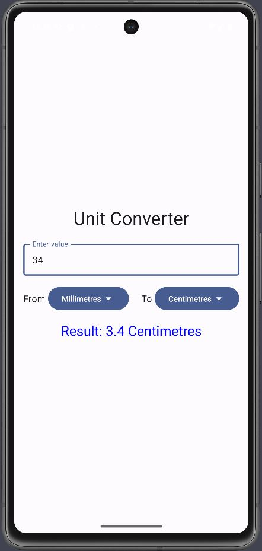
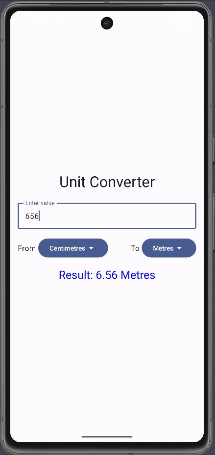

# 🚀 Overview
The Unit Converter App is a simple, intuitive application designed to help users easily convert between different units of measurement, including:

Length: Metres, Centimetres, Millimetres, Feet.

# 📸 Screenshots

  
  &nbsp;&nbsp;&nbsp;&nbsp;&nbsp;&nbsp;&nbsp;&nbsp;
  

 
Input Interface: Easily input your value and select the unit.
Output Interface: Instantaneous results are displayed clearly for user convenience.
